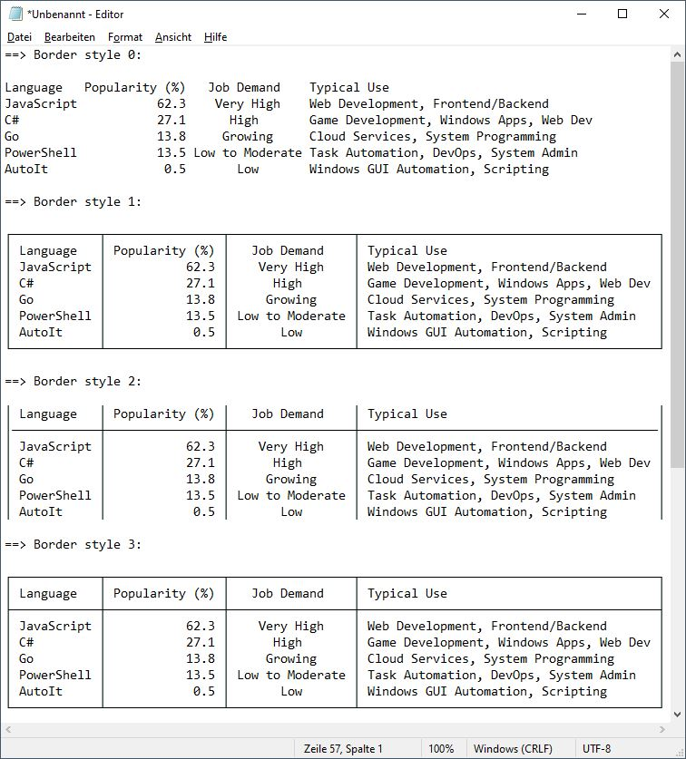

# Welcome to "data-to-table" 👋

This repository is a rewrite and enhancement of the nice AutoIt UDF "StringToTable.au3 by "ioa747".<br>
https://www.autoitscript.com/forum/topic/212876-_stringtotable/

Please check out the [upcoming features](#new-ideas-upcoming-features) section.

> All credits for the original logic go to ioa747 who made the UDF<br>
> with ❤️ for readable and elegant output.

<br>

## StringToTable.au3 v0.3.1 (by ioa747)

    ; ====================================================================================================
    ; Title...........: StringToTable UDF
    ; Description.....: Converts a string or array to a formatted table with alignment and frame options.
    ; AutoIt Version..: 3.3.16.1   Author: ioa747  Script Version: v0.3.1
    ; Note............: Testet in Win10 22H2
    ; ====================================================================================================

The `src/ioa747.au3` file includes the StringToTable UDF (`#include "..\lib\StringToTable.au3"`).

<br>

## DataToTable.au3 v0.2.0 (by Sven Seyfert (SOLVE-SMART))

    ; ====================================================================================================
    ; Title...........: DataToTable UDF
    ; Description.....: Converts a string or array to a formatted table with alignment and border options.
    ; AutoIt Version..: 3.3.16.1   Author: Sven Seyfert (SOLVE-SMART)   Script Version: v0.2.0
    ; Note............: Testet in Win10 22H2
    ; ====================================================================================================

The `src/solve-smart.au3` file includes the DataToTable UDF (`#include "..\lib\DataToTable.au3"`).

### Rewrite and enhancement

- more abstraction by separating code blocks into separate functions
- usage of maps
- enhanced error handling
- modification friendly

### New ideas (upcoming features)

- [ ] add markdown table format
- [ ] add gherkin feature table format
- [ ] check for other table related formats

<br>

## Result of the example input data

### Input as string

``` autoit
Local Const $sData = _
    'Language	Popularity (%)	Job Demand	Typical Use' & @CRLF & _
    'JavaScript	62.3	Very High	Web Development, Frontend/Backend' & @CRLF & _
    'C#	27.1	High	Game Development, Windows Apps, Web Dev' & @CRLF & _
    'Go	13.8	Growing	Cloud Services, System Programming' & @CRLF & _
    'PowerShell	13.5	Low to Moderate	Task Automation, DevOps, System Admin' & @CRLF & _
    'AutoIt	0.5	Low	Windows GUI Automation, Scripting'
```

### Input as array

``` autoit
Local Const $aData[][5] = _
    [ _
        ['Language',    'Popularity (%)', 'Job Demand',      'Typical Use'                             ], _
        ['JavaScript',  '62.3',           'Very High',       'Web Development, Frontend/Backend'       ], _
        ['C#',          '27.1',           'High',            'Game Development, Windows Apps, Web Dev' ], _
        ['Go',          '13.8',           'Growing',         'Cloud Services, System Programming'      ], _
        ['PowerShell',  '13.5',           'Low to Moderate', 'Task Automation, DevOps, System Admin'   ], _
        ['AutoIt',      '0.5',            'Low',             'Windows GUI Automation, Scripting'       ] _
    ]
```

### Output on console

It's not very obvious what are the differences between the variants are.<br>
So it's better to see the next section [Output in file or GUI](#output-in-file-or-gui).

==> Border style: "0=NoBorder"

    Language   Popularity (%)   Job Demand    Typical Use
    JavaScript           62.3    Very High    Web Development, Frontend/Backend
    C#                   27.1      High       Game Development, Windows Apps, Web Dev
    Go                   13.8     Growing     Cloud Services, System Programming
    PowerShell           13.5 Low to Moderate Task Automation, DevOps, System Admin
    AutoIt                0.5       Low       Windows GUI Automation, Scripting

==> Border style: "1=HeaderNoBorder"

    ¦ Language   ¦ Popularity (%) ¦   Job Demand    ¦ Typical Use                             ¦
    +------------+----------------+-----------------+-----------------------------------------¦
    ¦ JavaScript ¦           62.3 ¦    Very High    ¦ Web Development, Frontend/Backend       ¦
    ¦ C#         ¦           27.1 ¦      High       ¦ Game Development, Windows Apps, Web Dev ¦
    ¦ Go         ¦           13.8 ¦     Growing     ¦ Cloud Services, System Programming      ¦
    ¦ PowerShell ¦           13.5 ¦ Low to Moderate ¦ Task Automation, DevOps, System Admin   ¦
    ¦ AutoIt     ¦            0.5 ¦       Low       ¦ Windows GUI Automation, Scripting       ¦

==> Border style: "2=BorderNoHeader"

    +-----------------------------------------------------------------------------------------+
    ¦ Language   ¦ Popularity (%) ¦   Job Demand    ¦ Typical Use                             ¦
    ¦ JavaScript ¦           62.3 ¦    Very High    ¦ Web Development, Frontend/Backend       ¦
    ¦ C#         ¦           27.1 ¦      High       ¦ Game Development, Windows Apps, Web Dev ¦
    ¦ Go         ¦           13.8 ¦     Growing     ¦ Cloud Services, System Programming      ¦
    ¦ PowerShell ¦           13.5 ¦ Low to Moderate ¦ Task Automation, DevOps, System Admin   ¦
    ¦ AutoIt     ¦            0.5 ¦       Low       ¦ Windows GUI Automation, Scripting       ¦
    +-----------------------------------------------------------------------------------------+

==> Border style: "3=BorderAndHeader"

    +-----------------------------------------------------------------------------------------+
    ¦ Language   ¦ Popularity (%) ¦   Job Demand    ¦ Typical Use                             ¦
    +------------+----------------+-----------------+-----------------------------------------¦
    ¦ JavaScript ¦           62.3 ¦    Very High    ¦ Web Development, Frontend/Backend       ¦
    ¦ C#         ¦           27.1 ¦      High       ¦ Game Development, Windows Apps, Web Dev ¦
    ¦ Go         ¦           13.8 ¦     Growing     ¦ Cloud Services, System Programming      ¦
    ¦ PowerShell ¦           13.5 ¦ Low to Moderate ¦ Task Automation, DevOps, System Admin   ¦
    ¦ AutoIt     ¦            0.5 ¦       Low       ¦ Windows GUI Automation, Scripting       ¦
    +-----------------------------------------------------------------------------------------+

==> Border style: "4=BorderAndHeaderEdgesWithAccent"

    +-----------------------------------------------------------------------------------------+
    ¦ Language   ¦ Popularity (%) ¦   Job Demand    ¦ Typical Use                             ¦
    +------------+----------------+-----------------+-----------------------------------------¦
    ¦ JavaScript ¦           62.3 ¦    Very High    ¦ Web Development, Frontend/Backend       ¦
    ¦ C#         ¦           27.1 ¦      High       ¦ Game Development, Windows Apps, Web Dev ¦
    ¦ Go         ¦           13.8 ¦     Growing     ¦ Cloud Services, System Programming      ¦
    ¦ PowerShell ¦           13.5 ¦ Low to Moderate ¦ Task Automation, DevOps, System Admin   ¦
    ¦ AutoIt     ¦            0.5 ¦       Low       ¦ Windows GUI Automation, Scripting       ¦
    +-----------------------------------------------------------------------------------------+

### Output in file or GUI



<br>

## License

Copyright (c) 2025 Sven Seyfert (SOLVE-SMART)<br>
Distributed under the MIT License. See [LICENSE](https://github.com/sven-seyfert/data-to-table/blob/main/LICENSE.md) for more information.
