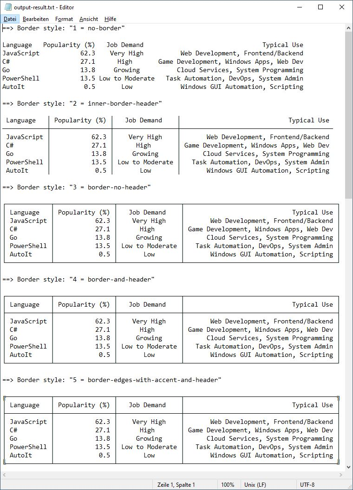
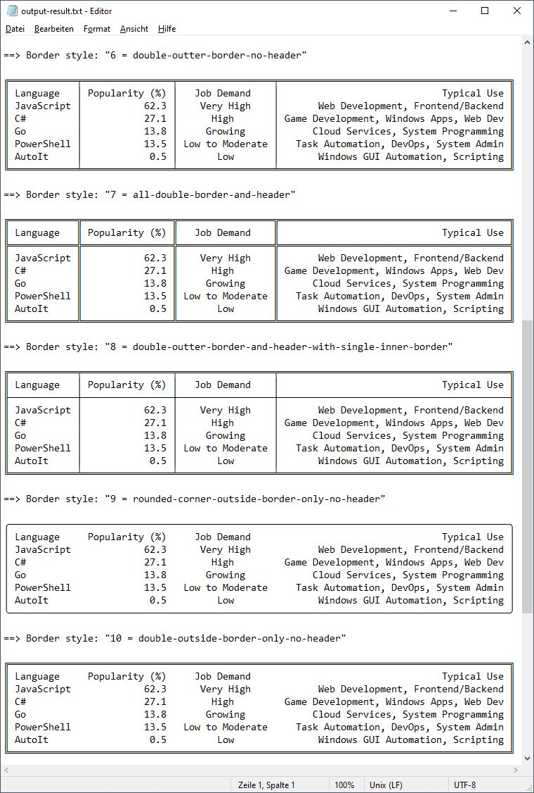

#####

# Welcome to "data-to-table" 👋

This library (UDF) allows you to transform input data, like strings or arrays, to a nice readable table output with different border styles. Output your data to console, file or GUI.

👉 Please check out the [upcoming features](#ideas--upcoming-features) section.

The repository is highly inspired by the great AutoIt UDF "StringToTable.au3" by "ioa747".<br>
Forum thread link: https://www.autoitscript.com/forum/topic/212876-_stringtotable/

> All credits for the **original logic** go to "ioa747" who made<br>
> the UDF with ❤️ for a readable and elegant output.

<br>

## Different approach compared to the original UDF (library)

- more abstraction by separate code blocks for separate responsibilities
- enhanced error handling
- usage of maps
- modification friendly / expandable

<br>

### Ideas / upcoming features

- [x] add more flexibility for border styles creation
- [ ] create how-to about how user can add border styles
- [ ] add *markdown table* format
- [ ] add *gherkin feature table* format
- [ ] check for other table related formats

<br>

## Result of the example input data

### Input as string

``` autoit
; The $sData string is separated (columns) by tabs.
Local Const $sData = _
    'Language	Popularity (%)	Job Demand	Typical Use' & @CRLF & _
    'JavaScript	62.3	Very High	Web Development, Frontend/Backend' & @CRLF & _
    'C#	27.1	High	Game Development, Windows Apps, Web Dev' & @CRLF & _
    'Go	13.8	Growing	Cloud Services, System Programming' & @CRLF & _
    'PowerShell	13.5	Low to Moderate	Task Automation, DevOps, System Admin' & @CRLF & _
    'AutoIt	0.5	Low	Windows GUI Automation, Scripting'
```

### Input as array

``` autoit
; Default separator is @TAB.
Local Const $aData[][5] = _
    [ _
        ['Language',    'Popularity (%)', 'Job Demand',      'Typical Use'                             ], _
        ['JavaScript',  '62.3',           'Very High',       'Web Development, Frontend/Backend'       ], _
        ['C#',          '27.1',           'High',            'Game Development, Windows Apps, Web Dev' ], _
        ['Go',          '13.8',           'Growing',         'Cloud Services, System Programming'      ], _
        ['PowerShell',  '13.5',           'Low to Moderate', 'Task Automation, DevOps, System Admin'   ], _
        ['AutoIt',      '0.5',            'Low',             'Windows GUI Automation, Scripting'       ] _
    ]
```

### Output result

⚠ The output result only looks good in case you use a monospace font in your file viewer/editor or in your GUI. On console it should be default to have a monospace font, but the border visualization differs a bit from the file output result.

#### Border style editor view (notepad.exe)

<details>
  <summary>👀 expand ↔ collapse</summary>




</details>

#### Border style markdown view

==> Border style: "1 = no-border"

    Language   Popularity (%)   Job Demand                                Typical Use
    JavaScript           62.3    Very High          Web Development, Frontend/Backend
    C#                   27.1      High       Game Development, Windows Apps, Web Dev
    Go                   13.8     Growing          Cloud Services, System Programming
    PowerShell           13.5 Low to Moderate   Task Automation, DevOps, System Admin
    AutoIt                0.5       Low             Windows GUI Automation, Scripting

==> Border style: "2 = inner-border-header"

     Language   │ Popularity (%) │   Job Demand    │                             Typical Use
    ────────────┼────────────────┼─────────────────┼─────────────────────────────────────────
     JavaScript │           62.3 │    Very High    │       Web Development, Frontend/Backend
     C#         │           27.1 │      High       │ Game Development, Windows Apps, Web Dev
     Go         │           13.8 │     Growing     │      Cloud Services, System Programming
     PowerShell │           13.5 │ Low to Moderate │   Task Automation, DevOps, System Admin
     AutoIt     │            0.5 │       Low       │       Windows GUI Automation, Scripting

==> Border style: "3 = border-no-header"

    ┌────────────┬────────────────┬─────────────────┬─────────────────────────────────────────┐
    │ Language   │ Popularity (%) │   Job Demand    │                             Typical Use │
    │ JavaScript │           62.3 │    Very High    │       Web Development, Frontend/Backend │
    │ C#         │           27.1 │      High       │ Game Development, Windows Apps, Web Dev │
    │ Go         │           13.8 │     Growing     │      Cloud Services, System Programming │
    │ PowerShell │           13.5 │ Low to Moderate │   Task Automation, DevOps, System Admin │
    │ AutoIt     │            0.5 │       Low       │       Windows GUI Automation, Scripting │
    └────────────┴────────────────┴─────────────────┴─────────────────────────────────────────┘

==> Border style: "4 = border-and-header"

    ┌────────────┬────────────────┬─────────────────┬─────────────────────────────────────────┐
    │ Language   │ Popularity (%) │   Job Demand    │                             Typical Use │
    ├────────────┼────────────────┼─────────────────┼─────────────────────────────────────────┤
    │ JavaScript │           62.3 │    Very High    │       Web Development, Frontend/Backend │
    │ C#         │           27.1 │      High       │ Game Development, Windows Apps, Web Dev │
    │ Go         │           13.8 │     Growing     │      Cloud Services, System Programming │
    │ PowerShell │           13.5 │ Low to Moderate │   Task Automation, DevOps, System Admin │
    │ AutoIt     │            0.5 │       Low       │       Windows GUI Automation, Scripting │
    └────────────┴────────────────┴─────────────────┴─────────────────────────────────────────┘

==> Border style: "5 = border-edges-with-accent-and-header"

    ╔────────────┬────────────────┬─────────────────┬─────────────────────────────────────────╗
    │ Language   │ Popularity (%) │   Job Demand    │                             Typical Use │
    ├────────────┼────────────────┼─────────────────┼─────────────────────────────────────────┤
    │ JavaScript │           62.3 │    Very High    │       Web Development, Frontend/Backend │
    │ C#         │           27.1 │      High       │ Game Development, Windows Apps, Web Dev │
    │ Go         │           13.8 │     Growing     │      Cloud Services, System Programming │
    │ PowerShell │           13.5 │ Low to Moderate │   Task Automation, DevOps, System Admin │
    │ AutoIt     │            0.5 │       Low       │       Windows GUI Automation, Scripting │
    ╚────────────┴────────────────┴─────────────────┴─────────────────────────────────────────╝

==> Border style: "6 = double-outter-border-no-header"

    ╔════════════╤════════════════╤═════════════════╤═════════════════════════════════════════╗
    ║ Language   │ Popularity (%) │   Job Demand    │                             Typical Use ║
    ║ JavaScript │           62.3 │    Very High    │       Web Development, Frontend/Backend ║
    ║ C#         │           27.1 │      High       │ Game Development, Windows Apps, Web Dev ║
    ║ Go         │           13.8 │     Growing     │      Cloud Services, System Programming ║
    ║ PowerShell │           13.5 │ Low to Moderate │   Task Automation, DevOps, System Admin ║
    ║ AutoIt     │            0.5 │       Low       │       Windows GUI Automation, Scripting ║
    ╚════════════╧════════════════╧═════════════════╧═════════════════════════════════════════╝

==> Border style: "7 = all-double-border-and-header"

    ╔════════════╦════════════════╦═════════════════╦═════════════════════════════════════════╗
    ║ Language   ║ Popularity (%) ║   Job Demand    ║                             Typical Use ║
    ╠════════════╬════════════════╬═════════════════╬═════════════════════════════════════════╣
    ║ JavaScript ║           62.3 ║    Very High    ║       Web Development, Frontend/Backend ║
    ║ C#         ║           27.1 ║      High       ║ Game Development, Windows Apps, Web Dev ║
    ║ Go         ║           13.8 ║     Growing     ║      Cloud Services, System Programming ║
    ║ PowerShell ║           13.5 ║ Low to Moderate ║   Task Automation, DevOps, System Admin ║
    ║ AutoIt     ║            0.5 ║       Low       ║       Windows GUI Automation, Scripting ║
    ╚════════════╩════════════════╩═════════════════╩═════════════════════════════════════════╝

==> Border style: "8 = double-outter-border-and-header-with-single-inner-border"

    ╔════════════╤════════════════╤═════════════════╤═════════════════════════════════════════╗
    ║ Language   │ Popularity (%) │   Job Demand    │                             Typical Use ║
    ╟────────────┼────────────────┼─────────────────┼─────────────────────────────────────────╢
    ║ JavaScript │           62.3 │    Very High    │       Web Development, Frontend/Backend ║
    ║ C#         │           27.1 │      High       │ Game Development, Windows Apps, Web Dev ║
    ║ Go         │           13.8 │     Growing     │      Cloud Services, System Programming ║
    ║ PowerShell │           13.5 │ Low to Moderate │   Task Automation, DevOps, System Admin ║
    ║ AutoIt     │            0.5 │       Low       │       Windows GUI Automation, Scripting ║
    ╚════════════╧════════════════╧═════════════════╧═════════════════════════════════════════╝

==> Border style: "9 = rounded-corner-outside-border-only-no-header"

    ╭─────────────────────────────────────────────────────────────────────────────────────────╮
    │ Language     Popularity (%)     Job Demand                                  Typical Use │
    │ JavaScript             62.3      Very High            Web Development, Frontend/Backend │
    │ C#                     27.1        High         Game Development, Windows Apps, Web Dev │
    │ Go                     13.8       Growing            Cloud Services, System Programming │
    │ PowerShell             13.5   Low to Moderate     Task Automation, DevOps, System Admin │
    │ AutoIt                  0.5         Low               Windows GUI Automation, Scripting │
    ╰─────────────────────────────────────────────────────────────────────────────────────────╯

==> Border style: "10 = double-outside-border-only-no-header"

    ╔═════════════════════════════════════════════════════════════════════════════════════════╗
    ║ Language     Popularity (%)     Job Demand                                  Typical Use ║
    ║ JavaScript             62.3      Very High            Web Development, Frontend/Backend ║
    ║ C#                     27.1        High         Game Development, Windows Apps, Web Dev ║
    ║ Go                     13.8       Growing            Cloud Services, System Programming ║
    ║ PowerShell             13.5   Low to Moderate     Task Automation, DevOps, System Admin ║
    ║ AutoIt                  0.5         Low               Windows GUI Automation, Scripting ║
    ╚═════════════════════════════════════════════════════════════════════════════════════════╝

<br>

## License

Copyright (c) 2025 Sven Seyfert (SOLVE-SMART)<br>
Distributed under the MIT License. See [LICENSE](https://github.com/sven-seyfert/data-to-table/blob/main/LICENSE.md) for more information.

## Acknowledgements

- Thanks to @ioa747 for his great work/idea of the StringToTable UDF
- Thanks to @argumentum, @WildByDesign and @ioa747 for all the suggestions
- Thanks to all the contributors (mentioned in the CHANGELOG)

##

[To the top](#)
